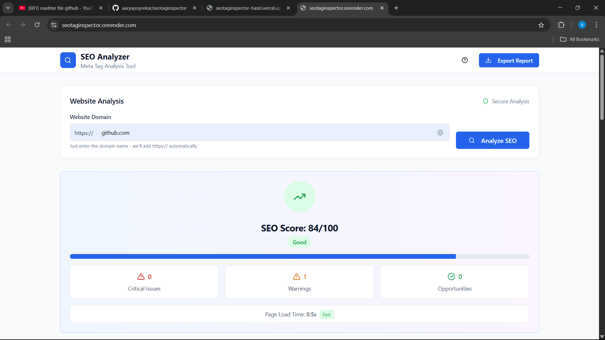
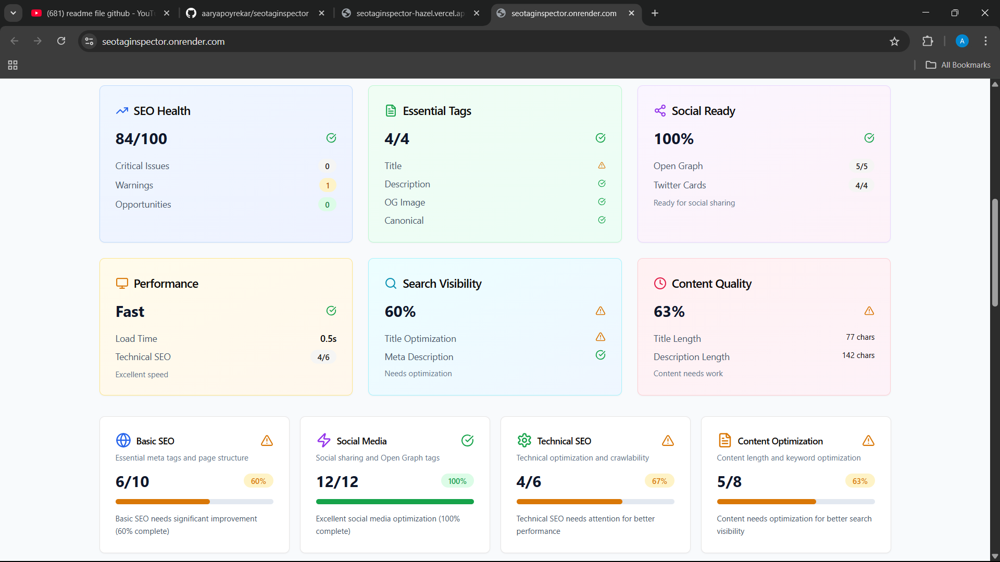
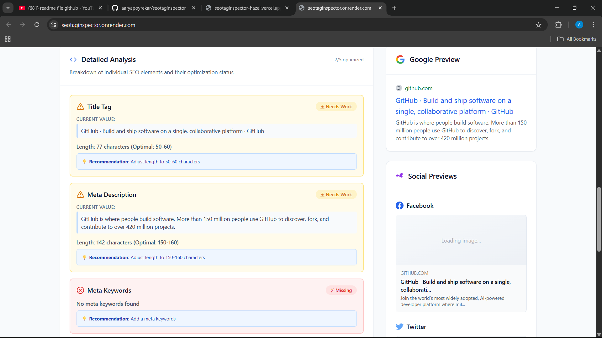
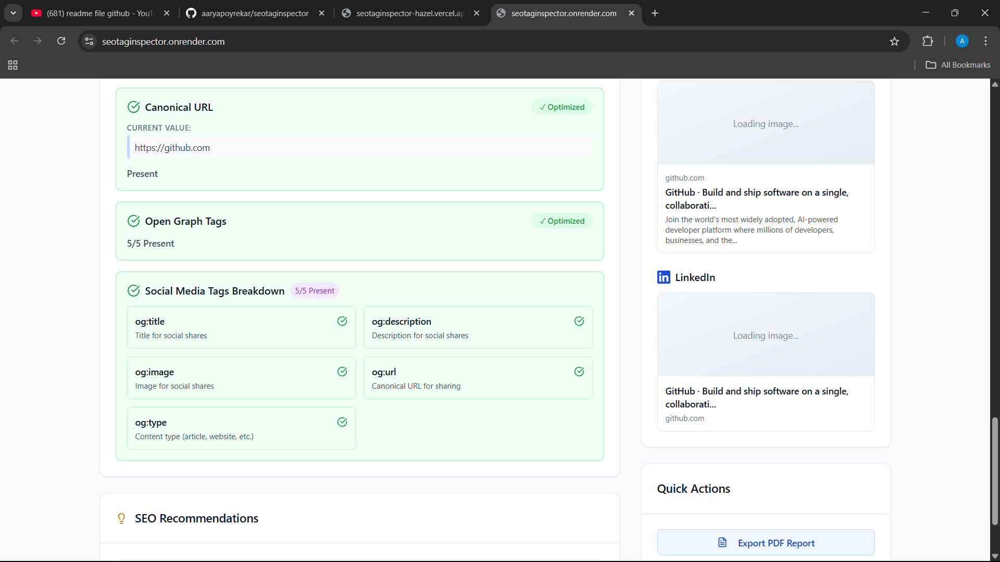

# 🔍 SEO Analyzer - Meta Tag Analysis Tool

**SEOtagInspector** is a beginner-friendly web tool that allows users to analyze and visualize a website's SEO meta tags and social previews. It checks Open Graph tags, meta titles, descriptions, keyword presence, and much more.

> 🌐 **Live Site**: [seotaginspector.onrender.com](https://seotaginspector.onrender.com)

---

## 📸 Screenshots

### 🏠 Homepage


### ✅ SEO Summary


### 📊 Social Previews


### 📋 Detailed Report


---

## 🚀 Features

- 🌐 Analyze any website’s SEO metadata
- 📷 Preview how links appear on LinkedIn, Twitter, Facebook
- 🧠 Open Graph and Twitter card tag analysis
- 📄 Export SEO report as PDF
- 📈 Visual SEO health and score dashboard

---

## 🛠 Built With

- **Frontend**: React + Tailwind CSS + TypeScript
- **Backend**: Node.js + Express
- **Deployment**: Render
- **Dev Platform**: Replit

---

## 🧪 How to Run Locally

```bash
git clone https://github.com/aaryapoyrekar/seotaginspector.git
cd seotaginspector
npm install
npm run dev
